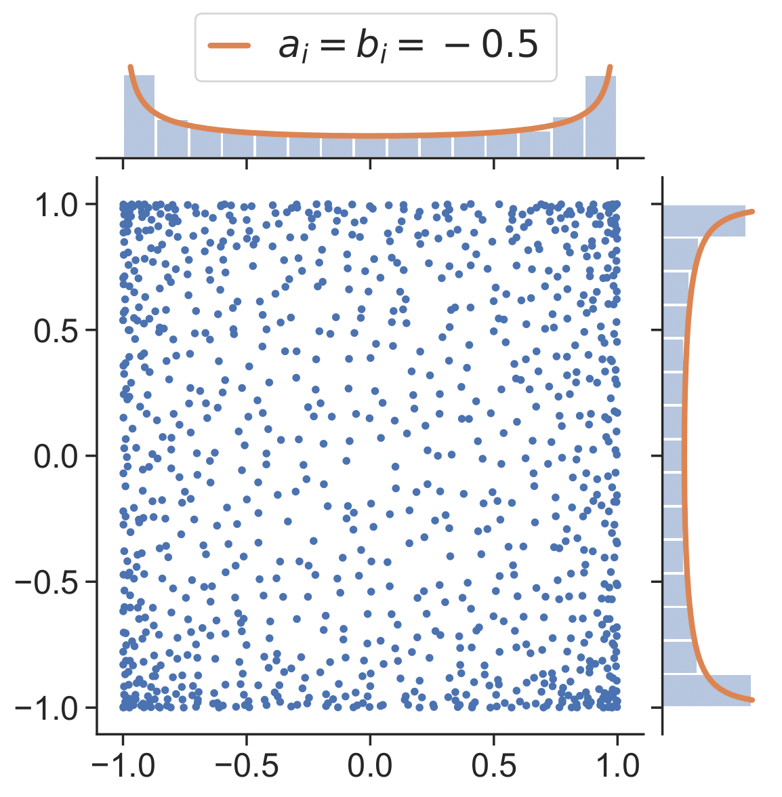
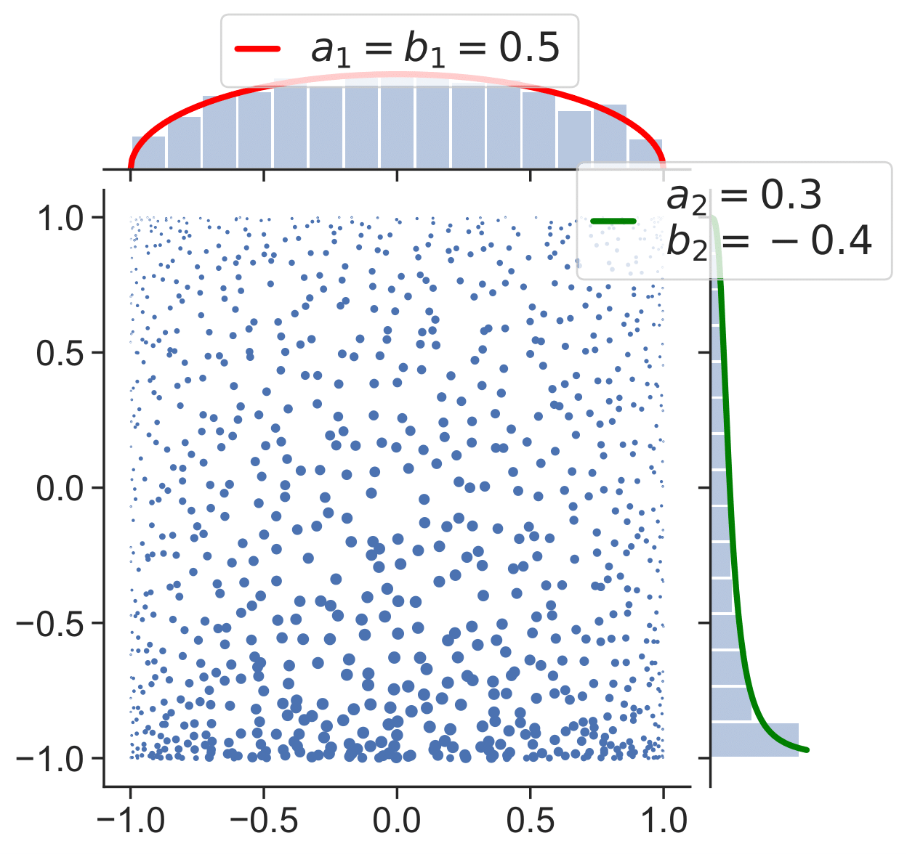

.. _multivariate_jacobi_ope:

Multivariate Jacobi ensemble
----------------------------

.. warning::

    For the details please refer to the documentation of :py:class:`~dppy.multivariate_jacobi_ope.MultivariateJacobiOPE` below, the associated
    `Notebook <hhttps://github.com/guilgautier/DPPy/blob/master/notebooks/>`_ and our `ICML'19 workshop paper <http://negative-dependence-in-ml-workshop.lids.mit.edu/wp-content/uploads/sites/29/2019/06/icml_camera_ready.pdf>`_

    .. important::

        In the current implementation of the chain rule, the proposal density is :math:`\frac{1}{N} K(x,x) w(x)` and not :math:`\prod_{i=1}^d \frac{1}{\pi\sqrt{1-(x^i)^2}}` as previously used by :cite:`BaHa16` (see also `their implementation  <https://github.com/rbardenet/dppmc>`_) and recycled in our `ICML'19 workshop paper <http://negative-dependence-in-ml-workshop.lids.mit.edu/wp-content/uploads/sites/29/2019/06/icml_camera_ready.pdf>`_!

        This yields faster sampling since less evaluations of the conditionnals involving Schur complements are required, see also :py:meth:`~dppy.multivariate_jacobi_ope.MultivariateJacobiOPE.sample`

.. automodule:: dppy.multivariate_jacobi_ope
    :members:
    :inherited-members:
    :show-inheritance:

.. .. plot:: plots/ex_plot_multivariate_jacobi_ope.py
..   :include-source:
