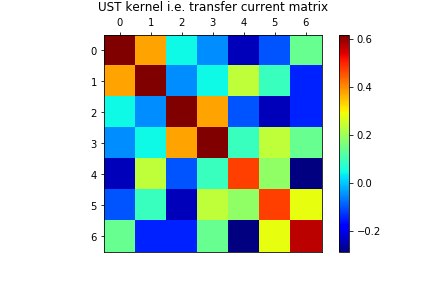
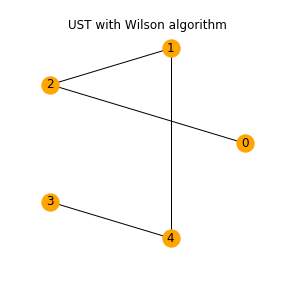
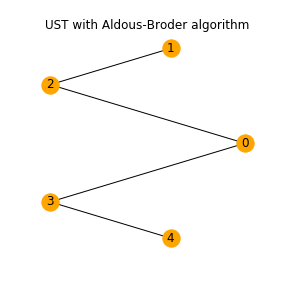
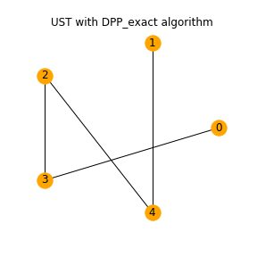

.. _exotic_dpps:

Exotic DPPs
###########

.. _UST:

Uniform Spanning Trees
**********************

The Uniform measure on Spanning Trees (UST) of a directed connected graph corresponds to a projection DPP with kernel the transfer current matrix of the graph.
The later is actually the orthogonal projection matrix onto the row span of the vertex-edge incidence matrix.
In fact, one can discard any row of the vertex-edge incidence matrix say :math:`A` to compute :math:`\mathbf{K}=A^{\top}[AA^{\top}]^{-1}A`.

.. code-block:: python

	from exotic_dpps import *

	# Build graph
	g = nx.Graph()
	edges = [(0,2), (0,3), (1,2), (1,4), (2,3), (2,4), (3,4)]
	g.add_edges_from(edges)

	# Initialize UST object
	ust = UST(g)
	# Display original graph
	ust.plot_graph()
	# Display some samples
	for md in ("Wilson", "Aldous-Broder", "DPP_exact"):
	    ust.sample(md); ust.plot()
	# Display underlyin kernel i.e. transfer current matrix
	ust.plot_kernel()

.. image:: ../_images/original_graph.png
   :width: 45%

.. image:: ../_images/ust_histo.png

.. seealso::

	- :ref:`exotic_dpps_api`
	- Wilson algorithm :cite:`PrWi98`
	- Aldous-Broder :cite:`Ald90`
	- :cite:`Lyo02`

.. _Stationary_1-dependent_process:

Stationary 1-dependent process
******************************

A point process :math:`\mathbb{X}` on :math:`\mathbb{Z}` (resp. :math:`\mathbb{N}`) is called 1-dependent if for any :math:`A,B\subset \mathbb{Z}` (resp. :math:`\mathbb{N}`), such as the distance between :math:`A` and :math:`B` is greater than 1,

:math:`\mathbb{P}(A\cup B\subset \mathbb{X})=\mathbb{P}(A\subset \mathbb{X})\mathbb{P}(B\subset \mathbb{X}).`

If :math:`\mathbb{X}` is stationary and 1-dependent then :math:`\mathbb{X}` forms a DPP.

The following 3 examples are stationary and 1-dependent process. 

.. _carries_process:

Carries process
===============

The sequence of carries appearing when computing the cumulative sum (in base :math:`b`) of a sequence of i.i.d. digits forms a DPP on :math:`\mathbb{N}` with non symmetric kernel.

.. plot:: plots/ex_plot_carries_process.py

..	seealso::

	:cite:`BoDiFu10`

.. _descent_process:

Descent process
===============

The descent process obtained from a uniformly chosen  permutation of  :math:`\{1,2,\dots,n\}` forms a DPP on :math:`\{1,2,\dots,n-1\}` with non symmetric kernel. It can be seen as the limit of the carries process as the base goes to infinity. 

.. plot:: plots/ex_plot_descent_process.py

..	seealso::

	:cite:`BoDiFu10`

.. _Limitting_descent_process:

Limiting Descent process for virtual permutations
==================================================

For non uniform permutations the descent process is not necessarily determinantal but in the particular case of virtual permutations with law stable under conjugation of the symmetric group the limiting descent process is a mixture of determinantal point processes.  

.. plot:: plots/ex_plot_virt_descent_process.py

..	seealso::

	:cite:`Kam18`

.. _poissonized_plancherel_measure:

Poissonized Plancherel measure
******************************

The poissonized Plancherel measure is a measure on partitions :math:`\lambda=(\lambda_1 \geq \lambda_2 \geq \cdots \geq 0)\in \mathbb{N}^{\mathbb{N}^*}`.
Samples from this measure can be obtained by:

- Sampling :math:`N \sim \mathcal{P}(\theta)`
- Sampling a uniform permutation :math:`\sigma\in \mathfrak{S}_N`
- Computing the sorting tableau :math:`P` associated to the RSK (`Robinson-Schensted-Knuth correspondence <https://en.wikipedia.org/wiki/Robinson%E2%80%93Schensted%E2%80%93Knuth_correspondence>`_) applied to :math:`\sigma`
- Considering only the shape :math:`\lambda` of :math:`P`.

Finally, the point process formed by :math:`\{\lambda_i - i + \frac12\}_{i\geq 1}` is a DPP on :math:`\mathbb{Z}+\frac12`.

.. plot:: plots/ex_plot_poissonized_plancherel.py

.. seealso::

	- :cite:`Bor09` Section 6

.. _exotic_dpps_api:

API
***

.. important::

	Check out the Notebook `Exotic DPPs <https://github.com/guilgautier/DPPy/blob/master/notebooks/exotic_dpps.ipynb>`_ 

.. currentmodule:: exotic_dpps

.. autoclass:: Descent
	:members:

.. automodule:: exotic_dpps
	:members:
	:inherited-members:
	:show-inheritance:
