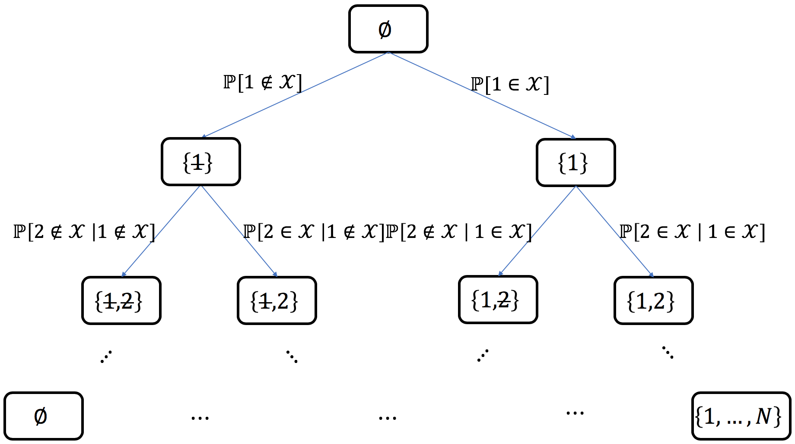

.. currentmodule:: dppy.finite_dpps

.. _finite_dpps_exact_sampling:

Exact sampling
**************

Consider a finite DPP defined by its correlation kernel :math:`\mathbf{K}` :eq:`eq:inclusion_proba_DPP_K` or likelihood kernel :math:`\mathbf{L}` :eq:`eq:likelihood_DPP_L`.
There exist three main types of exact sampling procedures:

1. The spectral method (used by default) requires the eigendecomposition of the correlation kernel :math:`\mathbf{K}` or the likelihood kernel :math:`\mathbf{L}`. It is based on the fact that :ref:`generic DPPs are mixtures of projection DPPs <finite_dpps_mixture>` together with the application of the chain rule to sample projection DPPs. It is presented in Section :ref:`finite_dpps_exact_sampling_spectral_method`.

2. A Cholesky-based procedure which requires the correlation kernel :math:`\mathbf{K}` (even non-Hermitian!). It boils down to applying the chain rule on sets; where each item in turn is decided to be excluded or included in the sample. It is presented in Section :ref:`finite_dpps_exact_sampling_cholesky_method`.

3. Recently, :cite:`DeCaVa19` have also proposed an alternative method to get exact samples: first sample an intermediate distribution and correct the bias by thinning the intermediate sample using a carefully designed DPP. This approach does not require a Cholesky/Eigen-decomposition of the DPP, but the runtime instead scale with the expected sample size of the DPP (see :ref:`finite_dpps_number_of_points`). It is presented in Section :ref:`finite_dpps_exact_sampling_intermediate_sampling_method`. A more refined procedure based on this approach was introduced in :cite:`CaDeVa20` for k-DPP sampling.

In general, for small :math:`N` (i.e. less than 1000) spectral or cholesky samplers
are recommended for numerical stability. For larger :math:`N` (i.e. up to millions)
and moderate :math:`k` (i.e. in the hundreds) intermediate sampling is recommended for scalability.

The following table summarizes the complexity of all exact samplers currently available,
where the expected sample size :math:`\mathbb{E}[|X|]` is equal to :math:`k` for k-DPPs
and :math:`d_{\text{eff}}` for random-sized DPPs.

+-----------------------+--------------+--------------------------------------+--------------------------------------+--------------------------------------+--------------------------------------+------------------------------------------------------------------------------+
|                       | ``mode=``    | Time to first sample                                                        |Time to subsequent samples                                                   | Notes                                                                        |
+                       +              +--------------------------------------+--------------------------------------+--------------------------------------+--------------------------------------+                                                                              +
|                       |              | DPP                                  |  k-DPP                               | DPP                                  |  k-DPP                               |                                                                              |
+=======================+==============+======================================+======================================+======================================+======================================+==============================================================================+
| Spectral sampler      |``"GS"``,     | :math:`O(N^3)`                       |:math:`O(N^3)`                        |:math:`O(N d_{\text{eff}}^2)`         |:math:`O(N k^2)`                      | The three variants differ slightly,                                          |
|                       |``"GS_bis"``, |                                      |                                      |                                      |                                      | and depending on the DPP they can                                            |
|                       |``"KuTa12"``  |                                      |                                      |                                      |                                      | have different numerical stability.                                          |
+-----------------------+--------------+--------------------------------------+--------------------------------------+--------------------------------------+--------------------------------------+------------------------------------------------------------------------------+
| Cholesky sampler      | ``"chol"``   | :math:`O(N^3)`                       |:math:`O(N^3)`                        |:math:`O(N^3)`                        |:math:`O(N^3)`                        | Also works for non-Hermitian DPPs.                                           |
+-----------------------+--------------+--------------------------------------+--------------------------------------+--------------------------------------+--------------------------------------+------------------------------------------------------------------------------+
| Intermediate sampler  | ``"vfx"``    | :math:`O(N d_{\text{eff}}^6)`        |:math:`O(N k^{10} + k^{15})`          |:math:`O(d_{\text{eff}}^6)`           |:math:`O(k^6)`                        | For ``"alpha"`` we report worst case runtime, but depending on the DPP       |
+                       +--------------+--------------------------------------+--------------------------------------+--------------------------------------+--------------------------------------+ structure best case runtime can be much faster than ``"vfx"``. For           |
|                       | ``"alpha"``  | :math:`O(N d_{\text{eff}}^5)`        |:math:`O(N k^6/d_{\text{eff}} + k^9)` |:math:`O(d_{\text{eff}}^6)`           |:math:`O(k^6)`                        | particularly ill-posed DPPs ``"vfx"`` can be more numerically stable.        |
+-----------------------+--------------+--------------------------------------+--------------------------------------+--------------------------------------+--------------------------------------+------------------------------------------------------------------------------+

.. note::

	- There exist specific samplers for special DPPs, like the ones presented in Section :ref:`exotic_dpps`.

.. important::

	In the next section, we describe the Algorithm 18 of :cite:`HKPV06`, based on the chain rule, which was originally designed to :ref:`sample continuous projection DPPs <continuous_dpps_exact_sampling_projection_dpp_chain_rule>`.
	Obviously, it has found natural a application in the finite setting for sampling projection :math:`\operatorname{DPP}(\mathbf{K})`.
	However, **we insist on the fact that this chain rule mechanism is specific to orthogonal projection kernels**.
	In particular, it cannot be applied blindly to sample general :math:`k\!\operatorname{-DPP}(\mathbf{L})` but it is valid when :math:`\mathbf{L}` is an orthogonal projection kernel.

	This crucial point is developed in the following :ref:`finite_kdpps_exact_sampling_chain_rule_projection_kernel_caution` section.

.. _finite_dpps_exact_sampling_projection_dpp_chain_rule:

Projection DPPs: the chain rule
-------------------------------

In this section, we describe the generic projection DPP sampler, originally derived by :cite:`HKPV06` Algorithm 18.

Recall that the :ref:`number of points of a projection <finite_dpps_properties_number_of_points_dpp_K_projection>` :math:`r=\operatorname{DPP}(\mathbf{K})` is, almost surely, equal to :math:`\operatorname{rank}(K)`, so that the likelihood :eq:`eq:likelihood_projection_K` of :math:`S=\{s_1, \dots, s_r\}` reads

.. math::

	\mathbb{P}[\mathcal{X}=S]
	= \det \mathbf{K}_S.

Using the invariance by permutation of the determinant and the fact that :math:`\mathbf{K}` is an orthogonal projection matrix, it is sufficient to apply the chain rule to sample :math:`(s_1, \dots, s_r)` with joint distribution

.. math::

	\mathbb{P}[(s_1, \dots, s_r)]
	= \frac{1}{r!} \mathbb{P}[\mathcal{X}=\{s_1, \dots, s_r\}]
	= \frac{1}{r!} \det \mathbf{K}_S,

and forget about the sequential feature of the chain rule to get a valid sample :math:`\{s_1, \dots, s_r\} \sim \operatorname{DPP}(\mathbf{K})`.

Considering :math:`S=\{s_1, \dots, s_r\}` such that :math:`\mathbb{P}[\mathcal{X}=S] = \det \mathbf{K}_S > 0`, the following generic formulation of the chain rule

.. math::

	\mathbb{P}[(s_1, \dots, s_r)]
	= \mathbb{P}[s_1]
		\prod_{i=2}^{r}
			\mathbb{P}[s_{i} | s_{1:i-1}],

can be expressed as a telescopic ratio of determinants

.. math::
	:label: eq:chain_rule_K

	\mathbb{P}[(s_1, \dots, s_r)]
	= \dfrac{\mathbf{K}_{s_1,s_1}}{r}
		\prod_{i=2}^{r}
			\dfrac{1}{r-(i-1)}
		\frac{\det \mathbf{K}_{S_i}}
			 {\det \mathbf{K}_{S_{i-1}}},

where :math:`S_{i-1} = \{s_{1}, \dots, s_{i-1}\}`.

Using `Woodbury's formula <https://en.wikipedia.org/wiki/Woodbury_matrix_identity>`_ the ratios of determinants in :eq:`eq:chain_rule_K` can be expanded into

.. math::
	:label: eq:chain_rule_schur

	\mathbb{P}[(s_1, \dots, s_r)]
	= \dfrac{\mathbf{K}_{s_1,s_1}}{r}
		\prod_{i=2}^{r}
			\dfrac{
				\mathbf{K}_{s_i, s_i} - \mathbf{K}_{s_i, S_{i-1}} {\mathbf{K}_{S_{i-1}}}^{-1} \mathbf{K}_{S_{i-1}, s_i}
				}{r-(i-1)}.

.. hint::

	MLers will recognize in :eq:`eq:chain_rule_schur` the incremental posterior variance of the Gaussian Process (GP) associated to :math:`\mathbf{K}`, see :cite:`RaWi06` Equation 2.26.

	.. caution::

		The connexion between the chain rule :eq:`eq:chain_rule_schur` and Gaussian Processes is valid in the case where the GP kernel is an **orthogonal projection kernel**, see also :ref:`finite_kdpps_exact_sampling_chain_rule_projection_kernel_caution`.

.. seealso::

    - Algorithm 18 :cite:`HKPV06`
    - :ref:`continuous_dpps_exact_sampling_projection_dpp_chain_rule` in the continuous case

.. _finite_dpps_exact_sampling_projection_dpp_chain_rule_geometrical_interpretation:

Geometrical interpretation
==========================

.. hint::

	Since :math:`\mathbf{K}` is an **orthogonal projection** matrix,
	the following Gram factorizations provide an insightful geometrical interpretation of the chain rule mechanism :eq:`eq:chain_rule_K`:

	1. Using :math:`\mathbf{K} = \mathbf{K}^2`
	and :math:`\mathbf{K}^{\dagger}=\mathbf{K}`, we have :math:`\mathbf{K} = \mathbf{K} \mathbf{K}^{\dagger}`, so that the chain rule :eq:`eq:chain_rule_K` becomes

	.. math::
		:label: eq:chain_rule_dist2_K

		\mathbb{P}[(s_1, \dots, s_r)]
		&=	\frac{1}{r!}
			\operatorname{Volume}^2(
			\mathbf{K}_{s_{1},:}, \dots, \mathbf{K}_{s_{r},:}
			)\\
		&=	\dfrac{\left\| \mathbf{K}_{s_1,:} \right\|^2}{r}
			\prod_{i=2}^{r}
			\dfrac{
				\operatorname{distance}^2
				(\mathbf{K}_{s_{i},:},
				\operatorname{Span}
					\left\{
					\mathbf{K}_{s_{1},:}, \dots, \mathbf{K}_{s_{i-1},:}
					\right\}
			}{r-(i-1)}.

	2. Using the eigendecomposition, we can write :math:`\mathbf{K} = U U^{\dagger}` where :math:`U^{\dagger} U = I_r`, so that the chain rule :eq:`eq:chain_rule_K` becomes

	.. math::
		:label: eq:chain_rule_dist2_U

		\mathbb{P}[(s_1, \dots, s_r)]
		&=	\frac{1}{r!}
			\operatorname{Volume}^2(
			U_{s_{1},:}, \dots, U_{s_{r},:}
			)\\
		&= \dfrac{\left\| U_{s_1,:} \right\|^2}{r}
			\prod_{i=2}^{r}
			\dfrac{
				\operatorname{distance}^2
				(U_{s_{i},:},
				\operatorname{Span}
					\left\{
					U_{s_{1},:}, \dots, U_{s_{i-1},:}
					\right\}
			}{r-(i-1)}.

	In other words, the chain rule formulated as :eq:`eq:chain_rule_dist2_K` and :eq:`eq:chain_rule_dist2_U` is akin to do Gram-Schmidt orthogonalization of the *feature vectors* :math:`\mathbf{K}_{i,:}` or :math:`\mathbf{U}_{i,:}`.
	These formulations can also be understood as an application of the base :math:`\times` height formula.
	In the end, projection DPPs favors sets of :math:`r=\operatorname{rank}(\mathbf{K})` of items are associated to feature vectors that span large volumes.
	This is another way of understanding :ref:`diversity <finite_dpps_diversity>`.

.. seealso::

	MCMC samplers

	- :ref:`zonotope sampling <finite_dpps_mcmc_sampling_zonotope>`
	- :ref:`basis exchange <finite_dpps_mcmc_sampling_E>`

.. _finite_dpps_exact_sampling_projection_dpp_chain_rule_in_practice:

In practice
===========

The cost of getting one sample from a **projection** DPP is of order :math:`\mathcal{O}(N\operatorname{rank}(\mathbf{K})^2)`, whenever :math:`\operatorname{DPP}(\mathbf{K})` is defined through

- :math:`\mathbf{K}` itself; sampling relies on formulations :eq:`eq:chain_rule_dist2_K` or :eq:`eq:chain_rule_schur`

	.. testcode::

		import numpy as np
		from scipy.linalg import qr
		from dppy.finite_dpps import FiniteDPP

		seed = 0
		rng = np.random.RandomState(seed)

		r, N = 4, 10
		eig_vals = np.ones(r)  # For projection DPP
		eig_vecs, _ = qr(rng.randn(N, r), mode='economic')

		DPP = FiniteDPP(kernel_type='correlation',
		                projection=True,
		                **{'K': (eig_vecs * eig_vals).dot(eig_vecs.T)})

		for mode in ('GS', 'Schur', 'Chol'):  # default: GS

		    rng = np.random.RandomState(seed)
		    DPP.flush_samples()

		    for _ in range(10):
		        DPP.sample_exact(mode=mode, random_state=rng)

		    print(DPP.sampling_mode)
		    print(DPP.list_of_samples)

	.. testoutput::

		GS
		[[5, 7, 2, 1], [4, 6, 2, 9], [9, 2, 6, 4], [5, 9, 0, 1], [0, 8, 6, 7], [9, 6, 2, 7], [0, 6, 2, 9], [5, 2, 1, 8], [5, 4, 0, 8], [5, 6, 9, 1]]
		Schur
		[[5, 7, 2, 1], [4, 6, 2, 9], [9, 2, 6, 4], [5, 9, 0, 1], [0, 8, 6, 7], [9, 6, 2, 7], [0, 6, 2, 9], [5, 2, 1, 8], [5, 4, 0, 8], [5, 6, 9, 1]]
		Chol
		[[5, 7, 6, 0], [4, 6, 5, 7], [9, 5, 0, 1], [5, 9, 2, 4], [0, 8, 1, 7], [9, 0, 5, 1], [0, 6, 5, 9], [5, 0, 1, 9], [5, 0, 2, 8], [5, 6, 9, 1]]

	.. seealso::

		- :py:meth:`~FiniteDPP.sample_exact`
		- :cite:`HKPV06` Theorem 7, Algorithm 18 and Proposition 19, for the original idea
		- :cite:`Pou19` Algorithm 3, for the equivalent Cholesky-based perspective with cost of order :math:`\mathcal{O}(N \operatorname{rank}(\mathbf{K})^2)`

- its eigenvectors :math:`U`, i.e., :math:`\mathbf{K}=U U^{\dagger}` with :math:`U^{\dagger}U = I_{\operatorname{rank}(\mathbf{K})}`; sampling relies on :eq:`eq:chain_rule_dist2_U`

	.. testcode::

		import numpy as np
		from scipy.linalg import qr
		from dppy.finite_dpps import FiniteDPP

		seed = 0
		rng = np.random.RandomState(seed)

		r, N = 4, 10
		eig_vals = np.ones(r)  # For projection DPP
		eig_vecs, _ = qr(rng.randn(N, r), mode='economic')

		DPP = FiniteDPP(kernel_type='correlation',
						projection=True,
						**{'K_eig_dec': (eig_vals, eig_vecs)})

		rng = np.random.RandomState(seed)

		for _ in range(10):
			# mode='GS': Gram-Schmidt (default)
			DPP.sample_exact(mode='GS', random_state=rng)

		print(DPP.list_of_samples)

	.. testoutput::

		[[5, 7, 2, 1], [4, 6, 2, 9], [9, 2, 6, 4], [5, 9, 0, 1], [0, 8, 6, 7], [9, 6, 2, 7], [0, 6, 2, 9], [5, 2, 1, 8], [5, 4, 0, 8], [5, 6, 9, 1]]

	.. seealso::

		- :py:meth:`~FiniteDPP.sample_exact`
		- :cite:`HKPV06` Theorem 7, Algorithm 18 and Proposition 19, for the original idea
		- :cite:`KuTa12` Algorithm 1, for a first interpretation of the spectral counterpart of :cite:`HKPV06` Algorithm 18 running in :math:`\mathcal{O}(N \operatorname{rank}(\mathbf{K})^3)`
		- :cite:`Gil14` Algorithm 2, for the :math:`\mathcal{O}(N \operatorname{rank}(\mathbf{K})^2)` implementation
		- :cite:`TrBaAm18` Algorithm 3, for a technical report on DPP sampling

.. _finite_dpps_exact_sampling_spectral_method:

Spectral method
---------------

Main idea
=========

The procedure stems from Theorem 7 of :cite:`HKPV06`, i.e., the fact that :ref:`generic DPPs are mixtures of projection DPPs <finite_dpps_mixture>`, suggesting the following two steps algorithm.
Given the spectral decomposition of the correlation kernel :math:`\mathbf{K}`

.. math::

	\mathbf{K}
	= U \Lambda U^{\dagger}
	= \sum_{n=1}^{N} \lambda_n u_n u_n^{\dagger}.

.. _finite_dpps_exact_sampling_spectral_method_step_1:

**Step 1.** Draw independent Bernoulli random variables :math:`B_n \sim \operatorname{\mathcal{B}er}(\lambda_n)` for :math:`n=1,\dots, N` and collect :math:`\mathcal{B}=\left\{ n ~;~ B_n=1 \right\}`,

.. _finite_dpps_exact_sampling_spectral_method_step_2:

**Step 2.** Sample from the **projection** DPP with correlation kernel :math:`U_{:\mathcal{B}} {U_{:\mathcal{B}}}^{\dagger} = \sum_{n\in \mathcal{B}} u_n u_n^{\dagger}`, see :ref:`the section above <finite_dpps_exact_sampling_projection_dpp_chain_rule_in_practice>`.

.. note::

	**Step 1.** selects a component of the mixture while
	**Step 2.** requires sampling from the corresponding **projection** DPP, cf. :ref:`finite_dpps_exact_sampling_projection_dpp_chain_rule`

In practice
===========

- Sampling *projection* :math:`\operatorname{DPP}(\mathbf{K})` from the eigendecomposition of :math:`\mathbf{K}=U U^{\dagger}` with :math:`U^{\dagger}U = I_{\operatorname{rank}(\mathbf{K})}`) was presented in :ref:`the section above <finite_dpps_exact_sampling_projection_dpp_chain_rule_in_practice>`

- Sampling :math:`\operatorname{DPP}(\mathbf{K})` from :math:`0_N \preceq\mathbf{K} \preceq I_N` can be done by following

  	**Step** 0. compute the eigendecomposition of :math:`\mathbf{K} = U \Lambda U^{\dagger}` in :math:`\mathcal{O}(N^3)`.

 	**Step** :ref:`1. <finite_dpps_exact_sampling_spectral_method_step_1>` draw independent Bernoulli random variables :math:`B_n \sim \operatorname{\mathcal{B}er}(\lambda_n)` for :math:`n=1,\dots, N` and collect :math:`\mathcal{B}=\left\{ n ~;~ B_n=1 \right\}`

	**Step** :ref:`2. <finite_dpps_exact_sampling_spectral_method_step_2>`
	sample from the **projection** DPP with correlation kernel defined by its eigenvectors :math:`U_{:, \mathcal{B}}`

	.. important::

		Step 0. must be performed once and for all in :math:`\mathcal{O}(N^3)`.
		Then the average cost of getting one sample by applying Steps 1. and 2. is :math:`\mathcal{O}(N \mathbb{E}\left[|\mathcal{X}|\right]^2)`, where :math:`\mathbb{E}\left[|\mathcal{X}|\right]=\operatorname{trace}(\mathbf{K})=\sum_{n=1}^{N} \lambda_n`.

	.. testcode::

		from numpy.random import RandomState
		from scipy.linalg import qr
		from dppy.finite_dpps import FiniteDPP

		rng = RandomState(0)

		r, N = 4, 10
		eig_vals = rng.rand(r)  # For projection DPP
		eig_vecs, _ = qr(rng.randn(N, r), mode='economic')

		DPP = FiniteDPP(kernel_type='correlation',
						projection=False,
						**{'K': (eig_vecs*eig_vals).dot(eig_vecs.T)})

		for _ in range(10):
			# mode='GS': Gram-Schmidt (default)
			DPP.sample_exact(mode='GS', random_state=rng)

		print(DPP.list_of_samples)

	.. testoutput::

		[[7, 0, 1, 4], [6], [0, 9], [0, 9], [8, 5], [9], [6, 5, 9], [9], [3, 0], [5, 1, 6]]

- Sampling :math:`\operatorname{DPP}(\mathbf{L})` from :math:`\mathbf{L} \succeq 0_N` can be done by following

  	**Step** 0. compute the eigendecomposition of :math:`\mathbf{L} = V \Gamma V^{\dagger}` in :math:`\mathcal{O}(N^3)`.

 	**Step** :ref:`1. <finite_dpps_exact_sampling_spectral_method_step_1>` is adapted to: draw independent Bernoulli random variables :math:`B_n \sim \operatorname{\mathcal{B}er}(\frac{\gamma_n}{1+\gamma_n})` for :math:`n=1,\dots, N` and collect :math:`\mathcal{B}=\left\{ n ~;~ B_n=1 \right\}`

	**Step** :ref:`2. <finite_dpps_exact_sampling_spectral_method_step_2>` is adapted to: sample from the **projection** DPP with correlation kernel defined by its eigenvectors :math:`V_{:,\mathcal{B}}`.

	.. important::

		Step 0. must be performed once and for all in :math:`\mathcal{O}(N^3)`.
		Then the average cost of getting one sample by applying Steps 1. and 2. is :math:`\mathcal{O}(N \mathbb{E}\left[|\mathcal{X}|\right]^2)`, where :math:`\mathbb{E}\left[|\mathcal{X}|\right]=\operatorname{trace}(\mathbf{L(I+L)^{-1}})=\sum_{n=1}^{N} \frac{\gamma_n}{1+\gamma_n}`

	.. testcode::

		from numpy.random import RandomState
		from scipy.linalg import qr
		from dppy.finite_dpps import FiniteDPP

		rng = RandomState(0)

		r, N = 4, 10
		phi = rng.randn(r, N)

		DPP = FiniteDPP(kernel_type='likelihood',
						projection=False,
						**{'L': phi.T.dot(phi)})

		for _ in range(10):
			# mode='GS': Gram-Schmidt (default)
			DPP.sample_exact(mode='GS', random_state=rng)

		print(DPP.list_of_samples)

	.. testoutput::

		[[3, 1, 0, 4], [9, 6], [4, 1, 3, 0], [7, 0, 6, 4], [5, 0, 7], [4, 0, 2], [5, 3, 8, 4], [0, 5, 2], [7, 0, 2], [6, 0, 3]]

- Sampling a :math:`\operatorname{DPP}(\mathbf{L})` for which each item is represented by a :math:`d\leq N` dimensional feature vector, all stored in a *feature matrix* :math:`\Phi \in \mathbb{R}^{d\times N}`, so that :math:`\mathbf{L}=\Phi^{\top} \Phi \succeq 0_N`, can be done by following

  	**Step** 0. compute the so-called *dual* kernel :math:`\tilde{L}=\Phi \Phi^{\dagger}\in \mathbb{R}^{d\times}`, eigendecompose it :math:`\tilde{\mathbf{L}} = W \Delta W^{\top}` and recover the eigenvectors of :math:`\mathbf{L}` as :math:`V=\Phi^{\top}W \Delta^{-\frac{1}{2}}`
  	This corresponds to a cost of order :math:`\mathcal{O}(Nd^2 + d^3 + d^2 + Nd^2)`.

 	**Step** :ref:`1. <finite_dpps_exact_sampling_spectral_method_step_1>` is adapted to: draw independent Bernoulli random variables :math:`B_i \sim \operatorname{\mathcal{B}er}(\frac{\delta_i}{1+\delta_i})` for :math:`i=1,\dots, d` and collect :math:`\mathcal{B}=\left\{ i ~;~ B_i=1 \right\}`

	**Step** :ref:`2. <finite_dpps_exact_sampling_spectral_method_step_2>` is adapted to: sample from the **projection** DPP with correlation kernel defined by its eigenvectors :math:`V_{:,\mathcal{B}} = \left[\Phi^{\top} W \Delta^{-1/2}\right]_{:,\mathcal{B}}`.

	.. important::

		Step 0. must be performed once and for all in :math:`\mathcal{O}(Nd^2 + d^3)`.
		Then the average cost of getting one sample by applying Steps 1. and 2. is :math:`\mathcal{O}(N \mathbb{E}\left[|\mathcal{X}|\right]^2)`, where :math:`\mathbb{E}\left[|\mathcal{X}|\right]=\operatorname{trace}(\mathbf{\tilde{L}(I+\tilde{L})^{-1}})=\sum_{i=1}^{d} \frac{\delta_i}{1+\delta_i}\leq d`

	.. seealso::

		For a different perspective see

		- :cite:`Gil14` Section 2.4.4 and Algorithm 3
		- :cite:`KuTa12` Section 3.3.3 and Algorithm 3

	.. testcode::

		from numpy.random import RandomState
		from scipy.linalg import qr
		from dppy.finite_dpps import FiniteDPP

		rng = RandomState(0)

		r, N = 4, 10
		phi = rng.randn(r, N)  # L = phi.T phi, L_dual = phi phi.T

		DPP = FiniteDPP(kernel_type='likelihood',
						projection=False,
						**{'L_gram_factor': phi})

		for _ in range(10):
			# mode='GS': Gram-Schmidt (default)
			DPP.sample_exact(mode='GS', random_state=rng)

		print(DPP.list_of_samples)

	.. testoutput::

		L_dual = Phi Phi.T was computed: Phi (dxN) with d<N
		[[9, 0, 2, 3], [0, 1, 5, 2], [7, 0, 9, 4], [2, 0, 3], [6, 4, 0, 3], [5, 0, 6, 3], [0, 6, 3, 9], [4, 0, 9], [7, 3, 9, 4], [9, 4, 3]]

.. _finite_dpps_exact_sampling_cholesky_method:

Cholesky-based method
---------------------

Main idea
=========

This method requires access to the correlation kernel :math:`\mathbf{K}` to perform a bottom-up chain rule on sets: starting from the empty set, each item in turn is decided to be added or excluded from the sample.
This can be summarized as the exploration of the binary probability tree displayed in :numref:`fig:cholesky_chain_rule_sets`.

   Probability tree corresponding to the chain rule on sets

**Example:** for :math:`N=5`, if :math:`\left\{ 1, 4 \right\}` was sampled, the path in the probability tree would correspond to

.. math::

	\mathbb{P}\!\left[\mathcal{X} = \left\{ 1, 4 \right\}\right]
	=
	&\mathbb{P}\!\left[
					1\in \mathcal{X}
				\right]\\
	&\times\mathbb{P}\!\left[
					2\notin \mathcal{X}
					\mid 1\in \mathcal{X}
				\right]\\
	&\times\mathbb{P}\!\left[
					3\notin \mathcal{X}
					\mid 1\in \mathcal{X}, 2\notin \mathcal{X}
				\right]\\
	&\times\mathbb{P}\!\left[
					4\in \mathcal{X}
					\mid 1\in \mathcal{X},
					\left\{ 2, 3 \right\} \cap \mathcal{X} = \emptyset
				\right]\\
	&\times\mathbb{P}\!\left[
					5\notin \mathcal{X}
					\mid \left\{ 1, 4 \right\} \subset \mathcal{X},
					\left\{ 2, 3 \right\} \cap \mathcal{X} = \emptyset
				\right],

where each conditional probability can be written in closed formed using :eq:`eq:conditioned_on_S_in_X` and :eq:`eq:conditioned_on_S_notin_X`, namely

.. math::

	\mathbb{P}[T \subset \mathcal{X} \mid S \subset \mathcal{X}]
        &= \det\left[\mathbf{K}_T - \mathbf{K}_{TS} \mathbf{K}_S^{-1} \mathbf{K}_{ST}\right]\\
	\mathbb{P}[T \subset \mathcal{X} \mid S \cap \mathcal{X} = \emptyset]
    	&= \det\left[\mathbf{K}_T - \mathbf{K}_{TS} (\mathbf{K}_S - I)^{-1} \mathbf{K}_{ST}\right].

.. important::

	This quantities can be computed efficiently as they appear in the computation of the Cholesky-type :math:`LDL^{\dagger}` or :math:`LU` factorization of the correlation :math:`\mathbf{K}` kernel, in the Hermitian or non-Hermitian case, respectively.
	See :cite:`Pou19` for the details.

.. note::

	The sparsity of :math:`\mathbf{K}` can be leveraged to derive faster samplers using the correspondence between the chain rule on sets and Cholesky-type factorizations, see e.g., :cite:`Pou19` Section 4.

In practice
===========

.. important::

	- The method is fully generic since it applies to any (valid), even non-Hermitian, correlation kernel :math:`\mathbf{K}`.
	- Each sample costs :math:`\mathcal{O}(N^3)`.
	- Nevertheless, the link between the chain rule on sets and Cholesky-type factorization is nicely supported by the surprisingly simple implementation of the corresponding generic sampler.

	.. code-block:: python

		# Poulson (2019, Algorithm 1) pseudo-code

		sample = []
		A = K.copy()

		for j in range(N):

			if np.random.rand() < A[j, j]:  # Bernoulli(A_jj)
				sample.append(j)
			else:
				A[j, j] -= 1

			A[j+1:, j] /= A[j, j]
			A[j+1:, j+1:] -= np.outer(A[j+1:, j], A[j, j+1:])

		return sample, A

.. testcode::

	from numpy.random import RandomState
	from scipy.linalg import qr
	from dppy.finite_dpps import FiniteDPP

	rng = RandomState(1)

	r, N = 4, 10
	eig_vals = rng.rand(r)
	eig_vecs, _ = qr(rng.randn(N, r), mode='economic')

	DPP = FiniteDPP(kernel_type='correlation',
					projection=False,
					**{'K': (eig_vecs*eig_vals).dot(eig_vecs.T)})

	for _ in range(10):
		DPP.sample_exact(mode='Chol', random_state=rng)

	print(DPP.list_of_samples)

.. testoutput::

	[[2, 9], [0], [2], [6], [4, 9], [2, 7, 9], [0], [1, 9], [0, 1, 2], [2]]

.. seealso::

	- :cite:`Pou19`
	- :cite:`LaGaDe18`

.. _finite_dpps_exact_sampling_intermediate_sampling_method:

Intermediate sampling method
----------------------------

Main idea
=========

This method is based on the concept of a **distortion-free intermediate sample**, where we draw a larger sample of points in such a way that we can then downsample to the correct DPP distribution. We assume access to the likelihood kernel :math:`\mathbf{L}` (although a variant of this method also exists for projection DPPs). Crucially the sampling relies on an important connection between DPPs and so-called **ridge leverage scores** (RLS, see :cite:`AlMa15`), which are commonly used for sampling in randomized linear algebra. Namely, the marginal probability of the i-th point in :math:`\mathcal{X} \sim \operatorname{DPP}(\mathbf{L})` is also the i-th ridge leverage score of :math:`\mathbf{L}` (with ridge parameter equal 1):

.. math::

	\mathbb{P}[i \in \mathcal{X}] = \big[\mathbf{L}(I + \mathbf{L})^{-1}\big]_{ii}=\tau_i,\quad i\text{th 1-ridge leverage score}.

Suppose that we draw a sample :math:`\sigma` of :math:`t` points i.i.d. proportional to ridge leverage scores, i.e., :math:`\sigma=(\sigma_1, \sigma_2,...,\sigma_t)` such that :math:`\mathbb{P}[\sigma_j=i]\propto\tau_i`. Intuitively, this sample is similar fo :math:`\mathcal{X}\sim \operatorname{DPP}(\mathbf{L})` because the marginals are the same, but it "ignores" all the dependencies between the points. However, if we sample sufficiently many points i.i.d. according to RLS, then a proper sample :math:`\mathcal{X}` will likely be contained within :math:`\sigma`. This can be formally shown for :math:`t = O(\mathbb{E}[|\mathcal{X}|]^2)`. When :math:`\mathbb{E}[|\mathcal{X}|]^2\ll N`, then this allows us to reduce the size of the DPP kernel :math:`\mathbf{L}` from :math:`N\times N` to a much smaller size :math:`\mathbf{\tilde{L}}` :math:`t\times t`. Making this sampling exact requires considerably more care, because even with a large :math:`t` there is always a small probability that the i.i.d. sample :math:`\sigma` is not sufficiently diverse. We guard against this possibility by rejection sampling.

.. important::
   Use this method for sampling  :math:`\mathcal{X} \sim \operatorname{DPP}(\mathbf{L})` when :math:`\mathbb{E}\left[|\mathcal{X}|\right]\ll\sqrt{N}`.

   - Preprocessing costs :math:`\mathcal{O}\big(N\cdot \text{poly}(\mathbb{E}\left[|\mathcal{X}|\right])\, \text{polylog}(N)\big)`.
   - Each sample costs :math:`\mathcal{O}\big(\mathbb{E}[|\mathcal{X}|]^6\big)`.

   There are two implementations of intermediate sampling available in :code:`dppy`: the :code:`mode='vfx'` sampler and the :code:`mode='alpha'` sampler.

In practice
===========
.. testcode::

    from numpy.random import RandomState
    from dppy.finite_dpps import FiniteDPP
    from dppy.utils import example_eval_L_linear

    rng = RandomState(1)

    r, N = 4, 10

    DPP = FiniteDPP('likelihood',
            **{'L_eval_X_data': (example_eval_L_linear, rng.randn(N, r))})

    for _ in range(10):
        DPP.sample_exact(mode='vfx', random_state=rng, verbose=False)

    print(DPP.list_of_samples)

.. testoutput::

    [[5, 1, 0, 3], [9, 0, 8, 3], [6, 4, 1], [5, 1, 2], [2, 1, 3], [3, 8, 4, 0], [0, 8, 1], [7, 8], [1, 8, 2, 0], [5, 8, 3]]

The ``verbose=False`` flag is used to suppress the default progress bars when running in batch mode (e.g. when generating these docs).

Given, the RLS :math:`\tau_1,\dots,\tau_N`, the normalization constant :math:`\det(I+\tilde{\mathbf L}_\sigma)` and access to the likelihood kernel :math:`\tilde{\mathbf L}_\sigma`, the intermediate sampling method proceeds as follows:

.. math::

	&\textbf{repeat}&\\
	&&\text{sample }t \sim\mathrm{Poisson}(k^2\,\mathrm{e}^{1/k}),\hspace{3.5cm}\text{where }k=\mathbb{E}[|\mathcal{X}|]\\
	&&\text{sample }\sigma_1,\dots,\sigma_t\sim (\tau_1,\dots\tau_N),\\
	&&\text{sample } \textit{Acc}\sim\!\text{Bernoulli}\Big(\frac{\mathrm{e}^{k}\det(I+\tilde{\mathbf{L}}_{\sigma})}{\mathrm{e}^{t/k}\det(I+\mathbf{L})}\Big),\quad\text{where }\tilde{L}_{ij} = \frac1{k\sqrt{\tau_i\tau_j}}L_{ij},\\
	&\textbf{until }&\textit{Acc}=\text{true}\\
	&\textbf{return }&\mathcal{X}=\{\sigma_i:i\in \tilde{\mathcal{X}}\}\quad\text{where }\tilde{\mathcal{X}}\sim \operatorname{DPP}(\tilde{\mathbf{L}}_{\sigma})

It can be shown that :math:`\mathcal{X}` is distributed exactly according to :math:`\operatorname{DPP}(\mathbf{L})` and the expected number of rejections is a small constant. The intermediate likelihood kernel :math:`\tilde{\mathbf L}_\sigma` forms a :math:`t\times t` DPP subproblem that can be solved using any other DPP sampler.

   - Since the size of the intermediate sample is :math:`t=\mathcal{O}(\mathbb{E}[\mathcal{X}]^2)`, the primary cost of the sampling is computing :math:`\det(I+\tilde{\mathbf L}_\sigma)` which takes :math:`\mathcal{O}(t^3)=\mathcal{O}(\mathbb{E}[\mathcal{X}]^6)` time. This is also the expected cost of sampling from :math:`\operatorname{DPP}(\tilde{\mathbf{L}}_{\sigma})` if we use, for example, the spectral method.
   - The algorithm requires precomputing the RLS :math:`\tau_1,\dots,\tau_n` and :math:`\det(I+\mathbf L)`. Computing them exactly takes :math:`\mathcal{O}(N^3)`, however, surprisingly, if we use sufficiently accurate approximations then the exactness of the sampling can be retained (details in :cite:`DeCaVa19`). Efficient methods for approximating leverage scores (see :cite:`RuCaCaRo18`) bring the precomputing cost down to :math:`\mathcal{O}(N \text{poly}(\mathbb{E}\left[|\mathcal{X}|\right]) \text{polylog}(N))`.
   - When :math:`\mathbb{E}[|\mathcal{X}|]` is sufficiently small, the entire sampling procedure only looks at a small fraction of the entries of :math:`\mathbf{L}`. This makes the method useful when we want to avoid constructing the entire likelihood kernel.
   - When the likelihood kernel is given implicitly via a matrix :math:`\mathbf{X}` such that :math:`\mathbf{L}=\mathbf{X}\mathbf{X}^\top` (dual formulation) then a version of this method is given by :cite:`Dere19`
   - A variant of this method also exists for projection DPPs :cite:`DeWaHs18`

.. seealso::

	- :cite:`DeCaVa19` (Likelihood kernel)
	- :cite:`Dere19` (Dual formulation)
	- :cite:`DeWaHs18` (Projection DPP)

.. _finite_dpps_exact_sampling_k_dpps:

:math:`k`-DPPs
--------------

Main idea
=========

:ref:`Recall from <finite_dpps_definition_k_dpps>` :eq:`eq:likelihood_kDPP_L` that :math:`k\!\operatorname{-DPP}(\mathbf{L})` can be viewed as a :math:`\operatorname{DPP}(\mathbf{L})` constrained to a have fixed cardinality :math:`k \leq \operatorname{rank}(L)`.

To generate a sample of :math:`k\!\operatorname{-DPP}(\mathbf{L})`, one natural solution would be to use a rejection mechanism: draw :math:`S \sim \operatorname{DPP}(\mathbf{L})` and keep it only if :math:`|X| = k`.
However, the rejection constant may be pretty bad depending on the choice of :math:`k` regarding the distribution of the number of points :eq:`eq:number_of_points` of :math:`S \sim \operatorname{DPP}(\mathbf{L})`.

An alternative solution was found by :cite:`KuTa12` Section 5.2.2.
The procedure relies on a slight modification of :ref:`Step 1. <finite_dpps_exact_sampling_spectral_method_step_1>` of the :ref:`finite_dpps_exact_sampling_spectral_method` which requires the computation of the `elementary symmetric polynomials <https://en.wikipedia.org/wiki/Elementary_symmetric_polynomial>`_.

In practice
===========

Sampling :math:`k\!\operatorname{-DPP}(\mathbf{L})` from :math:`\mathbf{L} \succeq 0_N` can be done by following

	**Step** 0.

		a) compute the eigendecomposition of :math:`\mathbf{L} = V \Gamma V^{\dagger}` in :math:`\mathcal{O}(N^3)`
		b) evaluate the `elementary symmetric polynomials <https://en.wikipedia.org/wiki/Elementary_symmetric_polynomial>`_ in the eigenvalues of :math:`\mathbf{L}`: :math:`E[l, n]:=e_l(\gamma_1, \dots, \gamma_n)` for :math:`0\leq l\leq k` and :math:`0\leq n\leq N`. These computations can done recursively in :math:`\mathcal{O}(N k)` using Algorithm 7 of :cite:`KuTa12`.

	**Step** :ref:`1. <finite_dpps_exact_sampling_spectral_method_step_1>` is replaced by Algorithm 8 of :cite:`KuTa12` which we illustrate with the following pseudo-code

		.. code-block:: python

			# Algorithm 8 of Kulesza Taskar (2012).
			# This is a pseudo-code of in particular Python indexing is not respected everywhere

			B = set({})
			l = k

			for n in range(N, 0, -1):

			  if Unif(0,1) < gamma[n] * E[l-1, n-1] / E[l, n]:
			    l -= 1
			    B.union({n})

			    if l == 0:
			      break

	**Step** :ref:`2. <finite_dpps_exact_sampling_spectral_method_step_2>` is adapted to: sample from the **projection** DPP with correlation kernel defined by its eigenvectors :math:`V_{:,\mathcal{B}}`, with a cost of order :math:`\mathcal{O}(N k^2)`.

.. important::

	Step 0. must be performed once and for all in :math:`\mathcal{O}(N^3 + Nk)`.
	Then the cost of getting one sample by applying Steps 1. and 2. is :math:`\mathcal{O}(N k^2)`.

.. testcode::

	import numpy as np
	from dppy.finite_dpps import FiniteDPP

	rng = np.random.RandomState(1)

	r, N = 5, 10
	# Random feature vectors
	Phi = rng.randn(r, N)
	DPP = FiniteDPP('likelihood', **{'L': Phi.T.dot(Phi)})

	k = 4
	for _ in range(10):
	    DPP.sample_exact_k_dpp(size=k, random_state=rng)

	print(DPP.list_of_samples)

.. testoutput::

	[[1, 8, 5, 7], [3, 8, 5, 9], [5, 3, 1, 8], [5, 8, 2, 9], [1, 2, 9, 6], [1, 0, 2, 3], [7, 0, 3, 5], [8, 3, 7, 6], [0, 2, 3, 7], [1, 3, 7, 5]]

.. seealso::

	- :py:meth:`~FiniteDPP.sample_exact_k_dpp`
	- Step 0. requires :cite:`KuTa12` Algorithm 7 for the recursive evaluation of the elementary symmetric polynomials :math:`[e_l(\gamma_1, \dots, \gamma_n)]_{l=1, n=1}^{k, N}` in the eigenvalues of :math:`\mathbf{L}`
	- Step 1. calls :cite:`KuTa12` Algorithm 8 for selecting the eigenvectors for Step 2.

.. _finite_kdpps_exact_sampling_chain_rule_projection_kernel_caution:

Caution
=======

.. attention::

	Since the number of points of :math:`k\!\operatorname{-DPP}(\mathbf{L})` is fixed, like for :ref:`projection DPPs <finite_dpps_properties_number_of_points_dpp_K_projection>`, it might be tempting to sample :math:`k\!\operatorname{-DPP}(\mathbf{L})` using a chain rule in the way it was applied in :eq:`eq:chain_rule_schur` to sample projection DPPs.
	**However, it is incorrect: sampling sequentially**

	.. math::
		:label: eq:chain_rule_caution

		s_1
			\propto \mathbf{L}_{s,s},
		\quad\text{then}\quad
		s_{i} \mid s_1, \dots, s_{i-1}
			\propto
				\mathbf{L}_{s, s}
				- \mathbf{L}_{s, S_{i-1}}
				  {\mathbf{L}_{S_{i-1}}}^{-1}
				  \mathbf{L}_{S_{i-1}, s},
		\quad \text{for } 2\leq i \leq k,

	where :math:`S_{i-1} = \{s_{1}, \dots, s_{i-1}\}`, **and forgetting about the order** :math:`s_{1}, \dots, s_{k}` **were selected does not provide a subset** :math:`\{s_{1}, \dots, s_{k}\} \sim k\!\operatorname{-DPP}(\mathbf{L})`, **in the general case**.
	**Nevertheless, it is valid when** :math:`\mathbf{L}` **is an orthogonal projection kernel!**

**Here are the reasons why**

1. First keep in mind that, the ultimate goal is to draw a **subset** :math:`S=\{ s_{1}, \dots, s_{k} \} \sim k\!\operatorname{-DPP}(\mathbf{L})` with probability :eq:`eq:likelihood_kDPP_L`

.. math::
	:label: eq:caution_likelihood_kDPP_L

	\mathbb{P}[\mathcal{X}=S]
	= \frac{1}{e_k(\mathbf{L})} \det \mathbf{L}_S 1_{|S|=k}.

2. Now, if we were to use the chain rule :eq:`eq:chain_rule_caution` this would correspond to sampling sequentially the items :math:`s_1, \dots, s_{k}`, so that the resulting **vector** :math:`(s_{1}, \dots, s_{k})` has probability

.. math::
	:label: eq:chain_rule_caution_vector

	\mathbb{Q}[(s_{1}, \dots, s_{k})]
	&= \dfrac{\mathbf{L}_{s_1,s_1}}{Z_1}
		\prod_{i=2}^{k}
			\dfrac{
				\mathbf{L}_{s_i, s_i} - \mathbf{L}_{s_i, S_{i-1}} {\mathbf{L}_{S_{i-1}}}^{-1} \mathbf{L}_{S_{i-1}, s_i}
				}{Z_i(s_{1}, \dots, s_{i-1})}\\
	&= \frac{1}{Z(s_{1}, \dots, s_{k})} \det \mathbf{L}_S.

Contrary to :math:`Z_1=\operatorname{trace}(\mathbf{L})`, the normalizations :math:`Z_i(s_{1}, \dots, s_{i-1})` of the successive conditionals depend, *a priori*, on the order :math:`s_{1}, \dots, s_{k}` were selected. For this reason we denote the global normalization constant :math:`Z(s_{1}, \dots, s_{k})`.

.. warning::

	Equation :eq:`eq:chain_rule_caution_vector` suggests that, the sequential feature of the chain rule matters, *a priori*; the distribution of :math:`\left(s_{1}, \dots, s_{k} \right)` is not `exchangeable <https://en.wikipedia.org/wiki/Exchangeable_random_variables>`_ *a priori*, i.e., it is not invariant to permutations of its coordinates.
	This fact, would only come from the normalization :math:`Z(s_{1}, \dots, s_{k})`, since :math:`\mathbf{L}_S` is invariant by permutation.

	.. note::

		To see this, let's compute the normalization constant :math:`Z_i(s_1, \dots, s_{i-1})` in :eq:`eq:chain_rule_caution_vector` for a generic :math:`\mathbf{L}\succeq 0_N` factored as :math:`\mathbf{L} = VV^{\dagger}`, with no specific assumption on :math:`V`.

		.. math::
			:label: eq:chain_rule_caution_normalization_constant_conditional

			Z_i(s_1, \dots, s_{i-1})
			&= \sum_{i=1}^N \mathbf{L}_{ii}
				- \mathbf{L}_{i,S_{i-1}} \mathbf{\mathbf{L}}_{S_{i-1}}^{-1} \mathbf{L}_{S_{i-1},i}\\
			&= \operatorname{trace}(
			    \mathbf{L}
			    - \mathbf{L}_{:, S_{i-1}}
			      \left[\mathbf{\mathbf{L}}_{S_{i-1}}\right]^{-1} \mathbf{L}_{S_{i-1}, :}
			    )\\
			&=  \operatorname{trace}\left(
			    \mathbf{L}
			    - V {V^{\dagger}}_{:,S_{i-1}}
			      \left[V_{S_{i-1},:} {V^{\dagger}}_{:,S_{i-1}}\right]^{-1}
			      V_{S_{i-1},:} V^{\dagger}
			    \right)\\
			&= 	\operatorname{trace}
				\big(
				\mathbf{L}_{ii}
				-
				\underbrace{{V_{S_{i-1}, :}}^{\dagger}
				 			\left[V_{S_{i-1}, :} {V_{S_{i-1}, :}}^{\dagger}\right]^{-1}
				 			V_{S_{i-1}, :}}_{\Pi_{V_{S_{i-1}, :}}}
				V^{\dagger}V
				\big)\\
			&= \operatorname{trace}(\mathbf{L})
			  - \operatorname{trace}(\Pi_{V_{S_{i-1}, :}}V^{\dagger}V),

		where :math:`\Pi_{V_{S_{i-1}, :}}` denotes the `orthogonal projection <https://en.wikipedia.org/wiki/Proofs_involving_the_Moore–Penrose_inverse#Projectors_and_subspaces>`_ onto :math:`\operatorname{Span}\{V_{s_1,:}, \dots, V_{s_i-1, :}\}`, the supspace spanned the feature vectors associated to :math:`s_{1}, \dots, s_{i-1}`.

Then, summing :eq:`eq:chain_rule_caution_vector` over the :math:`k!` permutations of :math:`1, \dots, k`, yields the probability of drawing the **subset** :math:`S=\left\{ s_{1}, \dots, s_{k} \right\}`, namely

.. math::
	:label: eq:chain_rule_caution_set

	\mathbb{Q}[\{ s_{1}, \dots, s_{k} \}]
	= \sum_{\sigma \in \mathfrak{S}_k}
		\mathbb{Q}[(s_{\sigma(1)}, \dots, s_{\sigma(k)})]
 	= \det\mathbf{L}_S
		\underbrace{
			\sum_{\sigma \in \mathfrak{S}_k}
			\frac{1}{Z(s_{\sigma(1)}, \dots, s_{\sigma(k)})}
			}_{
			1/Z_S
			}.

3. For the chain rule :eq:`eq:chain_rule_caution_vector` to be a valid procedure for sampling :math:`k\!\operatorname{-DPP}(\mathbf{L})`, we must be able to identify :eq:`eq:caution_likelihood_kDPP_L` and :eq:`eq:chain_rule_caution_set`, i.e., :math:`\mathbb{Q}[S] = \mathbb{P}[S]` for all :math:`|S|=k`, or equivalently :math:`Z_S = e_k(L)` for all :math:`|S|=k`.

.. important::

	A sufficient condition (very likely to be necessary) is that the joint distribution of :math:`(s_{1}, \dots, s_{k})`, generated by the chain rule mechanism :eq:`eq:chain_rule_caution_vector` is `exchangeable <https://en.wikipedia.org/wiki/Exchangeable_random_variables>`_ (invariant to permutations of the coordinates).
	In that case, the normalization in :eq:`eq:chain_rule_caution_vector` would then be constant :math:`Z(s_{1}, \dots, s_{k})=Z` .
	So that :math:`Z_S` would in fact play the role of the normalization constant of :eq:`eq:chain_rule_caution_set`, since it would be constant as well and equal to :math:`Z_S = \frac{Z}{k!}`.
	Finally, :math:`Z_S = e_k(L)` by identification of :eq:`eq:caution_likelihood_kDPP_L` and :eq:`eq:chain_rule_caution_set`.

**This is what we can prove in the particular case where** :math:`\mathbf{L}` **is an orthogonal projection matrix.**

To do this, denote :math:`r=\operatorname{rank}(\mathbf{L})` and recall that in this case :math:`\mathbf{L}` satisfies :math:`\mathbf{L}^2=\mathbf{L}` and :math:`\mathbf{L}^{\dagger}=\mathbf{L}`, so that it can be factored as :math:`\mathbf{L}=\Pi_{\mathbf{L}}=\mathbf{L}^{\dagger}\mathbf{L}=\mathbf{L}\mathbf{L}^{\dagger}`

Finally, we can plug :math:`V=\mathbf{L}` in :eq:`eq:chain_rule_caution_normalization_constant_conditional` to obtain

.. math::

	Z_i(s_1, \dots, s_{i-1})
	&= \operatorname{trace}(\mathbf{L})
	  - \operatorname{trace}(\Pi_{\mathbf{L}_{S_{i-1}, :}}\mathbf{L}^{\dagger}\mathbf{L})\\
	&= \operatorname{trace}(\Pi_{\mathbf{L}})
	  - \operatorname{trace}(\Pi_{\mathbf{L}_{S_{i-1}, :}}\Pi_{\mathbf{L}})\\
	&= \operatorname{trace}(\Pi_{\mathbf{L}})
	  - \operatorname{trace}(\Pi_{\mathbf{L}_{S_{i-1}, :}})\\
	&= \operatorname{rank}(\Pi_{\mathbf{L}})
	  - \operatorname{rank}(\Pi_{\mathbf{L}_{S_{i-1}, :}})\\
	&= r - (i - 1) := Z_i.

Thus, the normalization :math:`Z(s_1, \dots, s_k)` in :eq:`eq:chain_rule_caution_normalization_constant_conditional` is constant as well equal to

.. math::

	Z(s_1, \dots, s_k)
	= \prod_{i=1}^{k} Z_i
	= \prod_{i=1}^{k} r - (i - 1)
	= \frac{r!}{(r-k)!}
	= k! {r \choose k}
	= k! e_k(\mathbf{L})
	:= Z,

where the last equality is a simple computation of the `elementary symmetric polynomial <https://en.wikipedia.org/wiki/Elementary_symmetric_polynomial>`_

.. math::

	e_k(\mathbf{L})
	= e_k(\gamma_{1:r}=1, \gamma_{r+1:N}=0)
	= \sum_{\substack{S \subset [N]\\|S|=k}} \prod_{s\in S} \gamma_{s}
	= {r \choose k}

.. important::

	This shows that, when :math:`\mathbf{L}` is an orthogonal projection matrix, the order the items :math:`s_1, \dots, s_r` were selected by the chain rule :eq:`eq:chain_rule_caution_vector` can be forgotten, so that :math:`\{s_1, \dots, s_r\}` can be considered as valid sample of :math:`k\!\operatorname{-DPP}(\mathbf{L})`.

.. code-block:: python

	# For our toy example, this sub-optimized implementation is enough
	# to illustrate that the chain rule applied to sample k-DPP(L)
	# draws s_1, ..., s_k sequentially, with joint probability
	# P[(s_1, ..., s_k)] = det L_S / Z(s_1, ..., s_k)
	#
	# 1. is exchangeable when L is an orthogonal projection matrix
	#    P[(s1, s2)] = P[(s_2, s_1)]
	# 2. is a priori NOT exchangeable for a generic L >= 0
	#    P[(s1, s2)] /= P[(s_2, s_1)]

	import numpy as np
	import scipy.linalg as LA
	from itertools import combinations, permutations

	k, N = 2, 4
	potential_samples = list(combinations(range(N), k))

	rank_L = 3

	rng = np.random.RandomState(1)

	eig_vecs, _ = LA.qr(rng.randn(N, rank_L), mode='economic')

	for projection in [True, False]:

	    eig_vals = 1.0 + (0.0 if projection else 2 * rng.rand(rank_L))
	    L = (eig_vecs * eig_vals).dot(eig_vecs.T)

	    proba = np.zeros((N, N))
	    Z_1 = np.trace(L)

	    for S in potential_samples:

	        for s in permutations(S):

	            proba[s] = LA.det(L[np.ix_(s, s)])

	            Z_2_s0 = np.trace(L - L[:, s[:1]].dot(LA.inv(L[np.ix_(s[:1], s[:1])])).dot(L[s[:1], :]))

	            proba[s] /= Z_1 * Z_2_s0

	    print('L is {}projection'.format('' if projection else 'NOT '))

	    print('P[s0, s1]', proba, sep='\n')
	    print('P[s0]', proba.sum(axis=0), sep='\n')
	    print('P[s1]', proba.sum(axis=1), sep='\n')

	    print(proba.sum(), '\n' if projection else '')

.. code-block:: python

    L is projection
    P[s0, s1]
    [[0.         0.09085976 0.01298634 0.10338529]
     [0.09085976 0.         0.06328138 0.15368033]
     [0.01298634 0.06328138 0.         0.07580691]
     [0.10338529 0.15368033 0.07580691 0.        ]]
    P[s0]
    [0.20723139 0.30782147 0.15207463 0.33287252]
    P[s1]
    [0.20723139 0.30782147 0.15207463 0.33287252]
    1.0000000000000002

    L is NOT projection
    P[s0, s1]
    [[0.         0.09986722 0.01463696 0.08942385]
     [0.11660371 0.         0.08062998 0.20535251]
     [0.01222959 0.05769901 0.         0.04170435]
     [0.07995922 0.15726273 0.04463087 0.        ]]
    P[s0]
    [0.20879253 0.31482896 0.13989781 0.33648071]
    P[s1]
    [0.20392803 0.4025862  0.11163295 0.28185282]
    1.0
