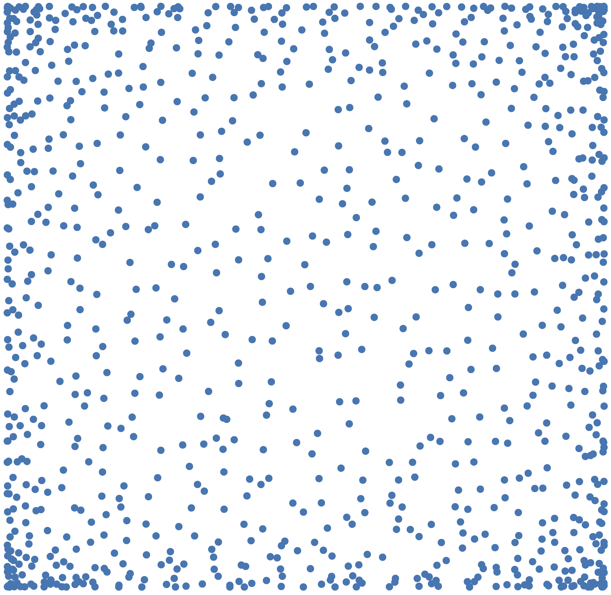
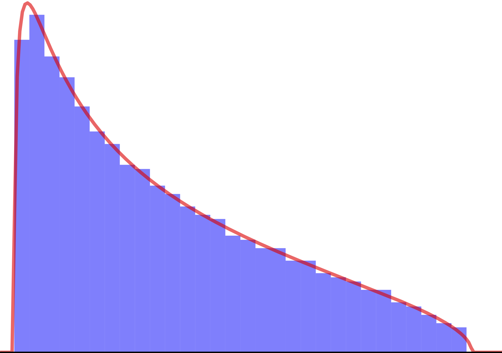
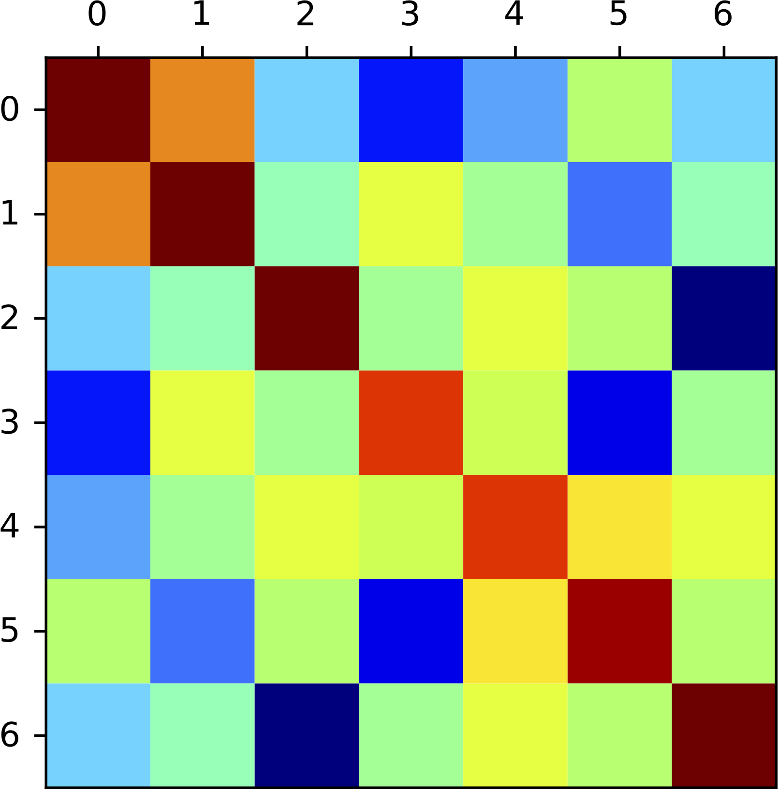

.. DPPy documentation master file, created by
	 sphinx-quickstart on Tue Jun  5 07:45:55 2018.
	 You can adapt this file completely to your liking, but it should at least
	 contain the root `toctree` directive.

.. |Documentation Status| image:: https://readthedocs.org/projects/dppy/badge/?version=latest
   :target: https://dppy.readthedocs.io/en/latest/?badge=latest

.. |Build Status| image:: https://travis-ci.com/guilgautier/DPPy.svg?branch=master
   :target: https://travis-ci.com/guilgautier/DPPy

.. |Coverage Status| image:: https://coveralls.io/repos/github/guilgautier/DPPy/badge.svg?branch=master
  :target: https://coveralls.io/github/guilgautier/DPPy?branch=master

.. |PyPI package| image:: https://badge.fury.io/py/dppy.svg
    :target: https://badge.fury.io/py/dppy

.. |Google Colab| image:: https://badgen.net/badge/Launch/on%20Google%20Colab/blue?icon=terminal
   :target: https://colab.research.google.com/github/guilgautier/DPPy/blob/master/notebooks/Tuto_DPPy.ipynbs

.. _DPPy: https://github.com/guilgautier/DPPy

|Documentation Status| |Build Status| |Coverage Status| |PyPI package|

.. |siren| replace:: 🚨
.. |fire| replace:: 🔥
.. |explosion| replace:: 💥
.. |palm_tree| replace:: 🌴
.. |tree| replace:: 🌿
.. |numbers| replace:: 🔢
.. |histogram| replace:: 📶
.. |die| replace:: 🎲

Welcome to DPPy_'s documentation!
########################################

**Determinantal point processes** (DPPs) are specific probability distributions over clouds of points, which have been popular as models or computational tools across physics, probability, statistics, random matrices, and more recently machine learning. DPPs are often used to induce diversity or repulsiveness among the points of a sample.

**Sampling from DPPs** is more tractable than sampling generic point processes with interaction, but it remains a nontrivial matter and a research area of its own.

As a contraction of **DPPs and Python**, DPPy_ is an effort to gather:

- :ref:`exact <finite_dpps_exact_sampling>` **and** :ref:`approximate <finite_dpps_mcmc_sampling>` **samplers** for :ref:`finite DPPs <finite_dpps>` |explosion|
- **random matrix models** (:ref:`full <full_matrix_models>` and :ref:`banded <banded_matrix_models>`) for :math:`\beta`-:ref:`Ensembles <beta_ensembles>` |fire|
- :ref:`multivariate_jacobi_ope` used for **Monte Carlo integration** |die|
- **exact samplers** for more :ref:`exotic_dpps` |palm_tree|

  * :ref:`uniform spanning trees <UST>` |tree|
  * :ref:`descent processes <stationary_1-dependent_process>` |numbers|
  * the :ref:`Poissonized Plancherel <poissonized_plancherel_measure>` |histogram|

The purpose of this **documentation** is to both provide a **quick survey of DPPs and relate each mathematical property with its implementation in DPPy**.
The documentation can thus be read in different ways:

	- if you read the sections in the order they appear, they will first take you through mathematical definitions and quick illustrations of how these definitions are encoded in DPPy.
	- for more a traditional library documentation please refer to the corresponding API sections documenting the methods of each object, along with pointers to the mathematical definitions if needed.
	- you can also directly jump to the Jupyter `notebooks <https://github.com/guilgautier/DPPy/tree/master/notebooks>`_, which showcase the use of some DPPy objects in more detail.

.. |cap1| replace:: 2D :ref:`multivariate_jacobi_ope`

.. |cap2| replace:: :math:`\beta=2`-:ref:`Laguerre ensemble <laguerre_full_matrix_model>`

.. |cap3| replace:: :math:`\mathbf{K}` kernel of :ref:`Uniform Spanning Tree <UST>`

.. |fig4|  image:: _images/original_graph.png
    :width: 100%
    :alt: graph associated to kernel K

.. |cap4| replace:: Graph associated to :math:`\mathbf{K}`

+---------+---------+
| |fig1|  | |fig2|  |
+---------+---------+
| |cap1|  | |cap2|  |
+---------+---------+
| |fig3|  | |fig4|  |
+---------+---------+
| |cap3|  | |cap4|  |
+---------+---------+

.. _index_installation_instructions:

Installation instructions
=========================

See the `installation instructions <https://github.com/guilgautier/DPPy#installation>`_ on GitHub.

.. _index_how_to_cite_this_work:

How to cite this work?
======================

We wrote a companion paper to
`DPPy <https://github.com/guilgautier/DPPy>`__ which is available on

-  `arXiv <http://arxiv.org/abs/1809.07258>`__ :cite:`GPBV19`
-  `GitHub <https://github.com/guilgautier/DPPy_paper>`__ for the lastest version

If you use this package, please consider citing it with this piece of
BibTeX:

.. code:: bibtex

  @article{GPBV19,
    archivePrefix = {arXiv},
    arxivId = {1809.07258},
    author = {Gautier, Guillaume and Polito, Guillermo and Bardenet, R{\'{e}}mi and Valko, Michal},
    journal = {Journal of Machine Learning Research - Machine Learning Open Source Software (JMLR-MLOSS), in press},
    title = {{DPPy: DPP Sampling with Python}},
    keywords = {Computer Science - Machine Learning, Computer Science - Mathematical Software, Statistics - Machine Learning},
    url = {http://arxiv.org/abs/1809.07258},
    year = {2018},
    note = {Code at http://github.com/guilgautier/DPPy/ Documentation at http://dppy.readthedocs.io/}
  }

Documentation contents
======================

.. toctree::
  :maxdepth: 3

  finite_dpps/index
  continuous_dpps/index
  exotic_dpps/index
  bibliography/index
