# [DPPy](https://github.com/guilgautier/DPPy) tutorial

### First used for tutorial at Groupe de Travail DPPs, 10/29/2018 - Painlevé, Univ. Lille 1

### Why are we here ?
---

#### DPPy
  + Acronym: DPP + Python
  + Python Toolbox for (sampling) DPPs
 
#### Goal
  + showcase the DPP samplers featured in DPPy
  + present tools behind the scene 
  
  [GitHub](https://github.com/guilgautier/DPPy)
  [](https://dppy.readthedocs.io/en/latest/?badge=latest)
  [](https://travis-ci.com/guilgautier/DPPy)
  + needs/suggestion for improvement

## Program of the day
---

## I.   Check installation
## II.   Sample DPPs with DPPy
## III.   Tools behind the scene
## IV.   Suggestions/needs

# I. Check installation
---

#### [Instructions](https://github.com/guilgautier/DPPy#installation)

### Any issue?

- [Travis](https://travis-ci.com/guilgautier/DPPy) says **no** :-)
    [](https://travis-ci.com/guilgautier/DPPy)


```python
#!rm -r DPPy
#!git clone https://github.com/guilgautier/DPPy.git
```


```python
#!pip install scipy --upgrade
#!pip install DPPy/.
```


```python
#@title ## Who is *using*:

GitHub = 1 #@param {type:"slider", min:0, max:20, step:1}
git = 1 #@param {type:"slider", min:0, max:20, step:1}
none = 0 #@param {type:"slider", min:0, max:20, step:1}
```

### Ready?

```bash
(cd DPPy)
jupyter notebook
```

# 💣💣💣💣
# To interact with source code, please uncomment the following cell
# 💣💣💣💣


```python
%load_ext autoreload
%autoreload 2

import os
import sys
sys.path.insert(0, os.path.abspath('..'))
```

# II. Sample DPPs with DPPy
----

## 1. Continuous DPPs: $\beta$-Ensembles
  + Hermite, Laguerre, Jacobi, Circular, Ginibre
  + matrix models (full/tridiagonal)

## 2. Finite DPPs

  + exact sampling
  + approximate sampling

## 3. Exotic DPPs
  + Uniform Spanning Trees
  + Plancherel (RSK, ...)
  + Descent Processes

## Main DPPy objects' methods

#### `.sample()`
#### `.plot()`

## II. 1. Continuous DPPs: $\beta$-Ensembles

### See [documentation](https://dppy.readthedocs.io/en/latest/continuous_dpps/index.html)

$$
(x_1,\dots,x_N) 
	\sim 
		\frac{1}{Z_{N,\beta}}
		\left|\Delta(x_1,\dots,x_N)\right|^{\beta}
		\prod_{i= 1}^N 
			\mu(d x_i)
$$

- Random matrix models
- $\beta=2$: projection DPPs

### d. Circular


```python
from dppy.beta_ensembles import CircularEnsemble

circular = CircularEnsemble(beta=2) # beta must be >=0 integer, default beta=2
```

#### Visualization of the cristallization as $\beta\in \mathbb{N}^*$ increases 


```python
#@title ##### Use a slider! (on G-Colab only!!)

_beta = 2 #@param {type:"slider", min:0, max:100, step:1}
_size = 30 #@param {type:"slider", min:0, max:100, step:1}

circular.beta = _beta
circular.sample_banded_model(size_N=_size)
circular.plot()
```


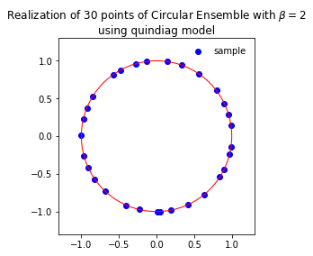


##### Or simply a loop


```python
for b in (0, 1, 5, 10):
    circular.beta = b
    circular.sample_banded_model(size_N=30)
    circular.plot()
```


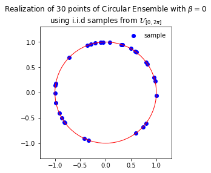


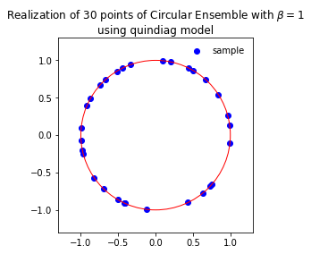


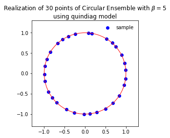


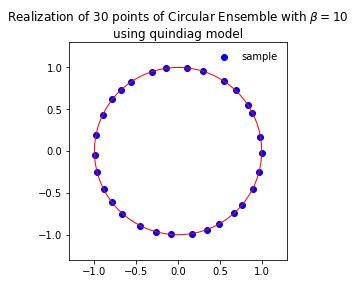


#### Sample using full matrix model, $\beta \in \{0, 1, 2, 4\}$


```python
circular.beta = 2
# 1. Plot the eigenvalues, they lie on the unit circle
circular.sample_full_model(size_N=30, haar_mode='Hermite') # Sample # haar_mode = 'Hermite'/'QR'
circular.plot() # Plot of the eigenvalues

# 2. Histogram of the angle of more points, should look uniform on [0,2pi]
circular.sample_full_model(size_N=1000, haar_mode='Hermite') # Sample
circular.hist()
```


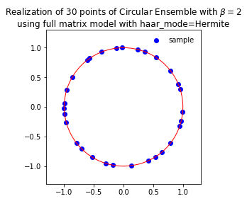


#### Sample using banded (quindiagonal) matrix model, $\beta \in \mathbb{N}^*$


```python
circular.beta = 8
circular.sample_banded_model(size_N=30)
circular.plot()

circular.sample_banded_model(size_N=1000)
circular.hist()
```


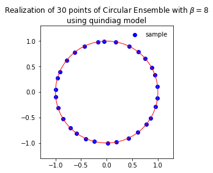


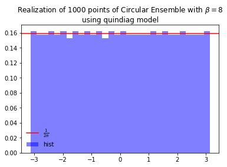


##### $\beta=0$, i.i.d. uniform points on the unit circle


```python
circular.beta = 0
circular.sample_banded_model(size_N=30)
circular.plot()
```


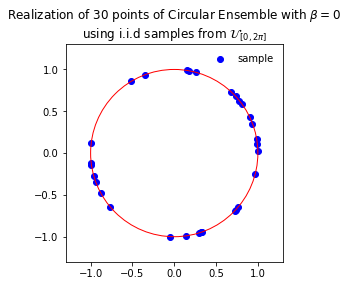


### a. Hermite $\mu = \mathcal{N}$


```python
from dppy.beta_ensembles import HermiteEnsemble

hermite = HermiteEnsemble(beta=4) # beta can be >=0, default beta=2
```

#### Sample using full matrix model, $\beta \in \{0, 1, 2, 4\}$


```python
hermite.sample_full_model(size_N=500)
# hermite.plot(normalization=True)
hermite.hist(normalization=True)
```


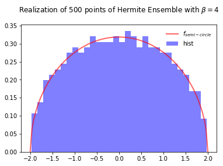


###### To compare with the sampling speed of the tridiagonal model simply use


```python
hermite.sample_banded_model(size_N=500)
hermite.hist(normalization=True)
```


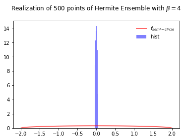


#### Sample using banded (tridiagonal) matrix model $\beta \in \mathbb{R}_+$ 


```python
# beta can be >= 0, default beta=2
hermite.beta= 5.43 # Or hermite = HermiteEnsemble(beta=5.43)
# Reference measure is N(mu, sigma^2)
hermite.sample_banded_model(loc=0.0, scale=1.0, size_N=500)
# hermite.plot(normalization=True)
hermite.hist(normalization=True)
```


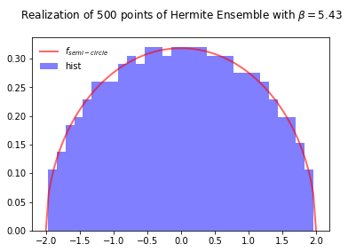


##### $\beta=0$, i.i.d. Gaussian


```python
# beta can be >= 0, default beta=2
hermite.beta= 0 # Or hermite = HermiteEnsemble(beta=5.43)
# Reference measure is N(mu, sigma^2)
hermite.sample_banded_model(size_N=1000)
# hermite.plot(normalization=True)
hermite.hist(normalization=True) # True: N(0,2) as in full matrix model
```


### b. Laguerre $\mu = \mathcal{\Gamma}$


```python
from dppy.beta_ensembles import LaguerreEnsemble

laguerre = LaguerreEnsemble(beta=1) # beta can be >= 0, default beta=2
```

#### Sample using full matrix model, $\beta \in \{0, 1, 2, 4\}$


```python
laguerre.sample_full_model(size_N=500, size_M=800) # M >= N
# laguerre.plot(normalization=True)
laguerre.hist(normalization=True)
```


###### To compare with the sampling speed of the tridiagonal model simply use


```python
laguerre.sample_banded_model(size_N=500, size_M=800)
laguerre.hist(normalization=True)
```


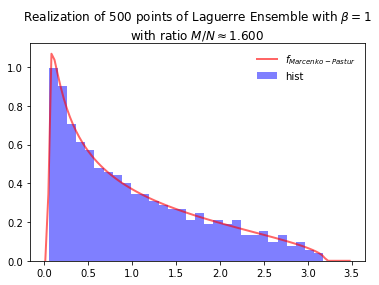


#### Sample using banded (tridiagonal) matrix model, $\beta \in \mathbb{R}_+$


```python
laguerre. beta = 2.98 # Or laguerre = LaguerreEnsemble(beta=2.98)
# Reference measure is Gamma(k, theta)
laguerre.sample_banded_model(shape=600, scale=2.0, size_N=400)
# laguerre.plot(normalization=True)
laguerre.hist(normalization=True)
```


##### $\beta=0$, i.i.d. $\Gamma(k,\theta)$
Error if using `size_M` as in full matrix model since `shape= k = 0`


```python
laguerre.beta = 0 
# Reference measure is Gamma(k, theta)
laguerre.sample_banded_model(shape=6, scale=4.0, size_N=1000)
# laguerre.plot(normalization=True)
laguerre.hist(normalization=True) # True: Gamma(shape, 2) as in full matrix model
```


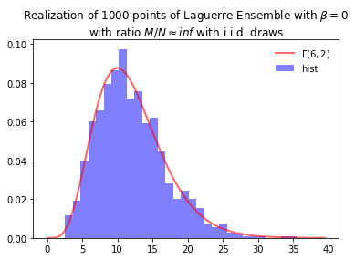


### c. Jacobi $\mu = \operatorname{Beta}$


```python
from dppy.beta_ensembles import JacobiEnsemble

jacobi = JacobiEnsemble(beta=2) # beta can be >= 0, default beta=2
```

#### Sample using full matrix model,  $\beta \in \{0, 1, 2, 4\}$


```python
jacobi.sample_full_model(size_N=400, size_M1=500, size_M2=600) # M_1, M_2 >= N
# jacobi.plot(normalization=True)
jacobi.hist(normalization=True)
```


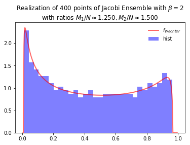


###### To compare with the sampling speed of the tridiagonal model simply use


```python
jacobi.sample_banded_model(size_N=400, size_M1=500, size_M2=600)
jacobi.hist(normalization=True)
```


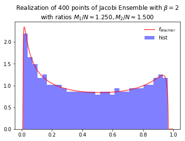


#### Sample using banded (tridiagonal) matrix model,  $\beta \in \mathbb{R}_+$


```python
# beta can be >= 0, default beta=2
jacobi.beta = 3.14 # Or jacobi = JacobiEnsemble(beta=3.14) 
# Reference measure is Beta(a,b)
jacobi.sample_banded_model(a=500, b=300, size_N=400)
# jacobi.plot(normalization=True)
jacobi.hist(normalization=True)
```


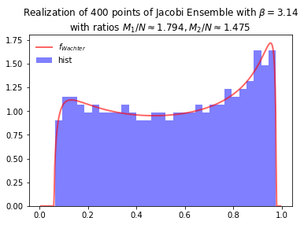


##### $\beta=0$, i.i.d. $\operatorname{Beta}(a,b)$
Error if using `size_M1,2` as in full matrix model since `a,b = 0`


```python
jacobi.beta = 0 
# Reference measure is Beta(a, b)
jacobi.sample_banded_model(a=6, b=4, size_N=1000)
# jacobi.plot(normalization=True)
jacobi.hist(normalization=True) # True/False: Beta(a, b)
```


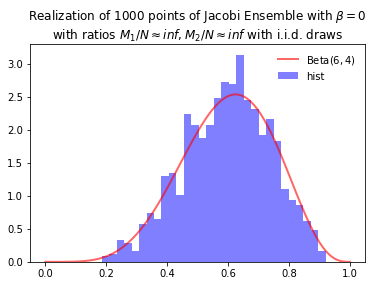


### (e) Ginibre $\beta = 2$ only


```python
from dppy.beta_ensembles import GinibreEnsemble

ginibre = GinibreEnsemble() # beta must be 2 (default)
```


```python
ginibre.sample_full_model(size_N=40)
ginibre.plot(normalization=True)
```


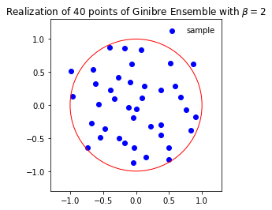


## II. 2. Discrete DPPs

### See [documentation](https://dppy.readthedocs.io/en/latest/finite_dpps/index.html)


```python
from dppy.finite_dpps import *
```

### Build inclusion kernel $\mathbf{K}$

$\operatorname{DPP}(\mathbf{K})$, with $\mathbf{K}\in\mathbb{R}^{N\times N}$ 

$$
	\mathbf{K} = \sum_{n=1}^{N} \lambda_n u_n u_n^{\top}
$$


```python
r, N = 10, 10 #

# Random orthogonal vectors
A = np.random.randn(r, N)
eig_vecs, _ = la.qr(A.T, mode="economic")
# Random eigenvalues
eig_vals = np.random.rand(r) # 0< <1
#eig_vals = np.random.choice([0.0, 1.0], size=r)# 0 or 1 i.e. projection

K = eig_vecs*eig_vals @ eig_vecs.T
```

### Declare a finite DPP in DPPy

#### 1. Via eigen-decomposition


```python
DPP = FiniteDPP("inclusion", **{"K_eig_dec":(eig_vals, eig_vecs)})

#print(DPP.K)
```

#### 2. Via its kernel


```python
DPP = FiniteDPP("inclusion", **{"K":K})
```

### Other features


#### a. Compute the *other* kernel 
- $L=K(I-K)^{-1}$


```python
DPP = FiniteDPP("inclusion", **{"K_eig_dec":(eig_vals, eig_vecs)})
print(DPP.L)
DPP.compute_L()
```

    None
    L (marginal) kernel computed via:
    - eig_L = eig_K/(1-eig_K)
    - U diag(eig_L) U.T


- $K=L(I+L)^{-1}$


```python
eig_vals = 4*np.random.rand(r) # >=0
DPP = FiniteDPP("marginal", **{"L_eig_dec":(eig_vals, eig_vecs)})
print(DPP.L)
DPP.compute_K()
```

    None
    K (inclusion) kernel computed via:
    - eig_K = eig_L/(1+eig_L)
    - U diag(eig_K) U.T


#### b. Compute/plot the underlying kernel


```python
eig_vals = np.random.rand(r) # 0< <1
DPP = FiniteDPP("inclusion", **{"K_eig_dec":(eig_vals, eig_vecs)})
DPP.plot_kernel()
```

    K (inclusion) kernel computed via:
    - U diag(eig_K) U.T


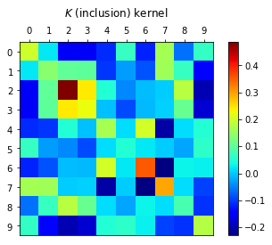


### Exact sampling scheme

- $\operatorname{DPP}(\mathbf{K})$, with $\mathbf{K}\in\mathbb{R}^{N\times N}$ 

$$
	\mathbf{K} = \sum_{n=1}^{N} \lambda_n u_n u_n^{\top}
$$

1. Draw independent $\operatorname{\mathcal{B}er}(\lambda_n)$ for each eigenvector $u_n$ and store the selected ones in $\tilde{U}$.
2. Sample from the corresponding *projection* $\operatorname{DPP}(\tilde{U}\tilde{U}^{\top})$.


```python
# Sample
for _ in range(10):
  DPP.sample_exact()

DPP.list_of_samples
```


    [[8, 7, 2, 4],
     [4, 5, 7, 3, 2],
     [2, 6, 9, 4, 7],
     [4, 1, 3, 7],
     [3, 6, 1, 8],
     [2, 3, 9, 6, 1],
     [2, 0, 7, 3, 9, 4],
     [7, 1, 4, 6],
     [3, 8, 2, 4, 9],
     [3, 6, 8, 7, 9, 0]]


```python
DPP.flush_samples()
DPP.list_of_samples
```


    []


### MCMC sampling

At state $S\subset [N]$, propose $S'$ different from $S$ by at most 2 elements by picking

#### 1. Local moves
- $s \sim \mathcal{U}_{S},  t \sim \mathcal{U}_{[N]\setminus S}$
- $|S'\Delta S| \leq 1$


```python
r, N = 4, 10
A = np.random.randn(r, N)
L = A.T.dot(A)
DPP = FiniteDPP("marginal", **{"L":L})
```

##### a. Exchange: 
$$S' \leftrightarrow S \setminus s \cup t$$


```python
DPP.flush_samples()
DPP.sample_mcmc("E") #AD, ADE
print(DPP.list_of_samples)
```

    L (marginal) kernel available
    [[[7, 6], [7, 2], [5, 2], [5, 2], [5, 2], [5, 2], [5, 2], [5, 2], [5, 2], [5, 2]]]


##### b. Add-Delete:
  - Add $S' \leftrightarrow S \cup t$
  - Delete $S' \leftrightarrow S \setminus s$


```python
DPP.flush_samples()
DPP.sample_mcmc("AD") #E, AD
print(DPP.list_of_samples)
```

    L (marginal) kernel available
    [[[4, 2, 3, 6], [4, 2, 3, 6], [4, 2, 3, 6], [4, 2, 3, 6], [4, 2, 3, 6], [4, 2, 3], [4, 2, 3], [4, 2, 3], [4, 2, 3, 0], [4, 2, 3, 0]]]


```python
A = np.random.randn(r, N)
eig_vecs, _ = la.qr(A.T, mode="economic")
eig_vals = np.random.rand(r)

DPP = FiniteDPP("inclusion", **{"K_eig_dec":(eig_vals,eig_vecs)})
DPP.sample_mcmc("AD")
print(DPP.list_of_samples)
```

    L (marginal) kernel computed via:
    - eig_L = eig_K/(1-eig_K)
    - U diag(eig_L) U.T
    [[[1], [1], [1], [1], [1], [1], [1], [1], [1], []]]


##### c. ADE


```python
DPP.flush_samples()
DPP.sample_mcmc("AED") #E, AD
print(DPP.list_of_samples)
```

    L (marginal) kernel available
    [[[2, 5, 8], [2, 5, 8], [2, 5, 8], [2, 5, 8], [2, 5, 8], [2, 5, 8], [2, 5, 8], [2, 5, 8], [2, 5, 8], [2, 5, 8]]]


#### 2. Zonotope


```python
r, N = 4, 10
A = np.random.randn(r, N)

DPP = FiniteDPP("inclusion", projection=True, **{"A_zono":A})

DPP.sample_mcmc("zonotope")
print(DPP.list_of_samples)
```

    [array([[0, 1, 7, 8],
           [1, 4, 6, 8],
           [0, 1, 3, 6],
           [0, 1, 3, 9],
           [0, 1, 3, 9],
           [0, 4, 6, 9],
           [0, 4, 6, 9],
           [1, 4, 6, 9],
           [0, 3, 4, 6],
           [0, 1, 3, 6]])]


## II. 3. Exotic DPPs
### See [documentation](https://dppy.readthedocs.io/en/latest/exotic_dpps/index.html)

- Uniform spanning trees
- Plancherel
- Descent Processes


```python
from dppy.exotic_dpps import *
```

### a. Uniform Spanning Trees

#### Uniform spanning trees of a connected graph


```python
g = nx.Graph()
edges = [(0,2), (0,3), (1,2), (1,4), (2,3), (2,4), (3,4)]
g.add_edges_from(edges)

ust = UST(g)

ust.plot_graph()
```

    /Users/ggautier/anaconda/lib/python3.5/site-packages/networkx/drawing/nx_pylab.py:611: MatplotlibDeprecationWarning: isinstance(..., numbers.Number)
      if cb.is_numlike(alpha):


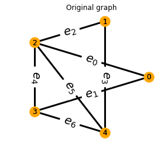


#### Display kernel


```python
ust.compute_kernel()
ust.plot_kernel()
```


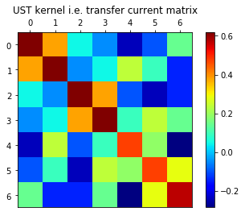


#### Sample a UST


```python
for md in ('Aldous-Broder', 'Wilson', 'DPP_exact'):
    ust.sample(md); ust.plot()
```


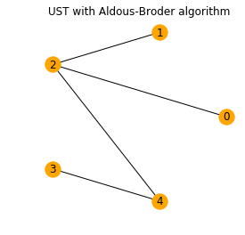


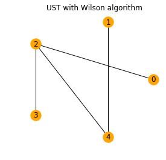


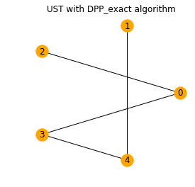


### b. (Poissonized) Plancherel

#### Choose a $\theta$ to sample a permutation $\sigma \in \mathfrak{S}_N$ with $N \sim \mathcal{P}(\theta)$


```python
theta=150 # Poisson parameter
pp_dpp = PoissonizedPlancherel(theta=theta)
pp_dpp.sample()
pp_dpp.plot()
```


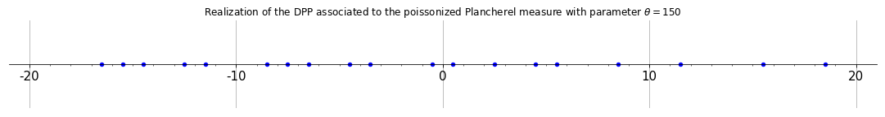


### c. Carries Process

#### Choose base $b$ to sample i.i.d. digits in $\{0, \dots, b-1\}$


```python
#@title ##### Use a slider!

_base = 3 #@param {type:"slider", min:0, max:10, step:1}
_size = 63 #@param {type:"slider", min:0, max:1000, step:1}

cp = CarriesProcess(_base)

cp.sample(_size)

cp.plot_vs_bernoullis()
plt.show()
```


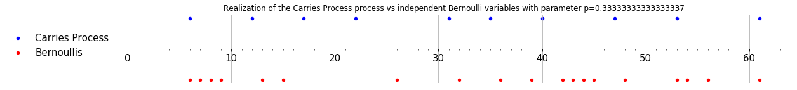


# III. Tools behind the scene

---


 - Host collaborative project [GitHub](https://github.com/guilgautier/DPPy)
 - Documentation [](https://dppy.readthedocs.io/en/latest/?badge=latest)
 - Continuous integration [](https://travis-ci.com/guilgautier/DPPy)
 
 
 #### Reproducible reasearch
 - [DPPy](https://github.com/guilgautier/DPPy)
 - companion paper [DPPy_paper](https://github.com/guilgautier/DPPy_paper)

# IV.   Suggestions/needs?

---

# [Raise an issue on GitHub](https://github.com/guilgautier/DPPy/issues) :)

*   
*
*
*
*
*   
*
*
*
*
